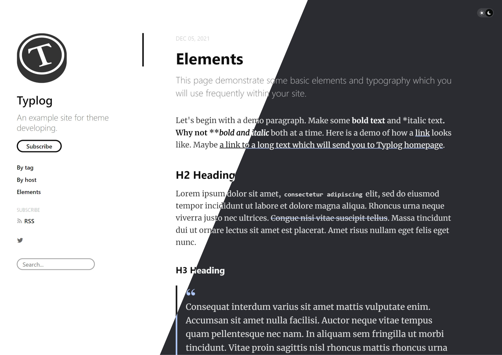

# UENO-Typecho

[UENO](https://github.com/typlog/ueno) 是 [Typlog](https://typlog.com/) 的默认主题。本项目为 UENO 在 [Typecho](https://typecho.org/) 上的移植版本。

## 提供的额外功能 / 选项

### 全局展示选项

- 站点主要色、次要色
- 站点 logo、favicon 地址
- 侧边栏社交媒体按钮（邮件、Github、Telegram、Instagram）
- 侧边栏链接（最多 3 个）
- 自定义 CSS
- 自定义页尾
- 自定义页脚链接
- 自定义页脚

### 全局功能

- 亮 / 暗主题切换（文章暗色模式仅在 Yue 主题下生效）
- （可选）基于 [Highlight.js](https://highlightjs.org/) 的代码高亮，在前端执行
- （可选）基于 [Mathjax3](https://www.mathjax.org/) 的公式渲染，在前端执行

### 文章

- 副标题
- 文章封面图（留空则使用文章中的第一张图片）
- 版式（三个选项分别对应 Typlog 中的 Yue、Snow、Lotus 三个主题）

## 开始使用

将本仓库克隆至 Typecho 的主题目录下（`path/to/typecho/usr/themes/`），Typecho 会自动识别。然后，在顶栏的 控制台 → 设置外观 → 可以使用的外观 面板中可以切换主题，在「设置外观」面板中可以设置上述选项。**调整设置后，不要忘记点击「保存设置」按钮。**

## 授权模式

由于上游仓库 [typlog/ueno](https://github.com/typlog/ueno) 未提供协议，为尊重原作者，本项目保持无协议状态。您可在此项目基础上二次修改或分发，但由此产生的潜在版权或商业纠纷与本仓库作者无关。

如您是上游仓库的作者并认为此仓库侵权，请联系 [@Linho1219](https://github.com/Linho1219) 删除。
